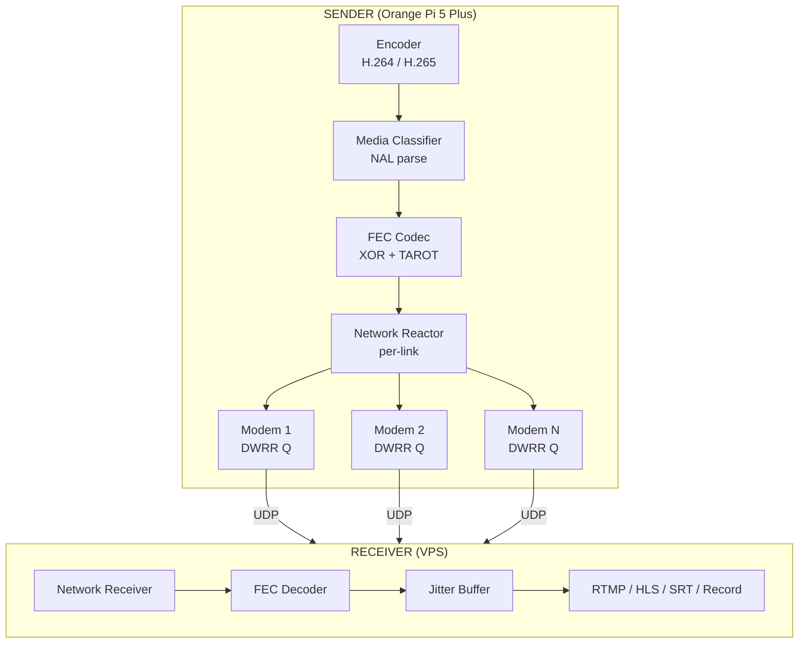

<p align="center">
  <strong>Strata</strong><br/>
  <em>Open-source bonded cellular video transport — the $15,000 LiveU alternative, written in Rust.</em>
</p>

<p align="center">
  <a href="https://github.com/RephlexZero/strata/actions/workflows/ci.yml"></a>
  <a href="LICENSE"></a>
</p>

---

Strata bonds 2–6 unreliable network interfaces — USB cellular modems, WiFi, Ethernet, satellite — into a single resilient live video stream. It ships as a **GStreamer plugin** (`stratasink` / `stratasrc`) and a standalone CLI (`strata-pipeline`).

Built for field deployment on commodity ARM64 hardware (Orange Pi 5 Plus, Raspberry Pi 5) with off-the-shelf USB modems. Pure Rust from the wire protocol up — no C transport dependencies, no vendor lock-in.

### Why Strata?

| Capability | LiveU | TVU | Dejero | SRT | RIST | **Strata** |
|---|---|---|---|---|---|---|
| N-link bonding | ✓ (6+) | ✓ (12) | ✓ (3-6) | Limited | Load share | **2-6 links** |
| Per-packet scheduling | ✓ | ✓ | ✓ | Round-robin | — | **IoDS / BLEST** |
| RF-aware routing | ✓ | ✓ | ✓ | ✗ | ✗ | **Biscay CC** |
| Adaptive FEC | Dynamic | RaptorQ | — | ✗ | ✗ | **TAROT cost function** |
| Media-aware priority | ✓ | ✓ | ✓ | ✗ | ✗ | **NAL classification** |
| Encoder feedback loop | ✓ | ✓ | ✓ | ✗ | TR-06-04 | **Built-in** |
| Hardware encoder support | ✓ | ✓ | ✓ | Manual | Manual | **Auto-detect** |
| Open source | ✗ | ✗ | ✗ | ✓ | Spec only | **✓** |
| Price | $15K+ | $15K+ | $15K+ | Free | Free | **Free** |

---

## Quick Start — Cellular Bonding to YouTube

The primary use case: stream live video from a field device over 2+ USB cellular modems, bonded into a single stream and relayed to YouTube.

### What You Need

**Sender (field device):**
- Orange Pi 5 Plus (or any ARM64 Linux SBC)
- 2–3 USB cellular modems with SIM cards on **different carriers**
- HDMI capture card (or USB camera)

**Receiver (cloud):**
- Any Linux VPS (Hetzner, DigitalOcean, etc.)
- Firewall open on 2–3 UDP ports (one per link)

### 1. Install on Both Machines

Pre-built binaries for **x86_64** and **aarch64** Linux are on the [Releases](https://github.com/RephlexZero/strata/releases) page.

```bash
VERSION="v0.6.0"  # check Releases page for latest
ARCH="$(uname -m)"
curl -LO "https://github.com/RephlexZero/strata/releases/download/${VERSION}/strata-${VERSION}-${ARCH}-linux-gnu.tar.gz"
tar xzf strata-*.tar.gz
sudo install -m 755 strata-pipeline /usr/local/bin/
sudo install -m 644 libgststrata.so /usr/lib/${ARCH}-linux-gnu/gstreamer-1.0/
gst-inspect-1.0 stratasink   # verify
```

Only GStreamer 1.x runtime packages are needed — the transport is pure Rust with no C dependencies.

```bash
# Sender (Orange Pi / ARM64) — also needs encoder plugins
sudo apt-get install -y \
  gstreamer1.0-plugins-base gstreamer1.0-plugins-good \
  gstreamer1.0-plugins-bad gstreamer1.0-plugins-ugly \
  gstreamer1.0-libav gstreamer1.0-tools

# Receiver (VPS / x86_64) — same packages
sudo apt-get install -y \
  gstreamer1.0-plugins-base gstreamer1.0-plugins-good \
  gstreamer1.0-plugins-bad gstreamer1.0-plugins-ugly \
  gstreamer1.0-libav gstreamer1.0-tools
```

> **Hardware encoding:** `strata-pipeline` auto-detects hardware encoders. On Orange Pi 5 Plus, install the Rockchip MPP GStreamer plugin for hardware H.265 encoding. On x86 with Intel, VA-API is auto-detected. Falls back to software x265enc/x264enc if no hardware encoder is found.

### 2. Set Up Cellular Modems (Sender)

Each modem must be on a **different subnet** — this is the most common gotcha. If both modems default to `192.168.8.0/24` (common with Huawei HiLink dongles), change one to `192.168.9.0/24` via the modem's admin UI at `http://192.168.8.1`.

```bash
# Verify each modem has its own subnet and can reach the internet
ip addr show   # look for your modem interfaces (enx..., wwan0, usb0, etc.)
curl --interface enp2s0f0u4 https://ifconfig.me    # modem 1
curl --interface enp2s0f0u3 https://ifconfig.me    # modem 2
```

See the [Cellular Modem Setup](https://github.com/RephlexZero/strata/wiki/Cellular-Modem-Setup) wiki page for detailed instructions including policy routing.

> **Important:** `SO_BINDTODEVICE` requires `CAP_NET_RAW`. Either run with `sudo` or grant the capability:
> ```bash
> sudo setcap cap_net_raw+ep /usr/local/bin/strata-pipeline
> ```

### 3. Start the Receiver (VPS)

```bash
strata-pipeline receiver \
  --bind 0.0.0.0:5000,0.0.0.0:5002 \
  --relay-url "rtmp://a.rtmp.youtube.com/live2/YOUR_STREAM_KEY" \
  --codec h265
```

For YouTube HLS upload instead of RTMP:

```bash
strata-pipeline receiver \
  --bind 0.0.0.0:5000,0.0.0.0:5002 \
  --relay-url "https://a.upload.youtube.com/http_upload_hls?cid=YOUR_CID&copy=0&file=" \
  --codec h265
```

### 4. Start the Sender (Orange Pi)

```bash
# Create sender config
cat > sender.toml << 'EOF'
[[links]]
id = 0
uri = "YOUR_VPS_IP:5000"
interface = "enp2s0f0u4"    # first modem interface

[[links]]
id = 1
uri = "YOUR_VPS_IP:5002"
interface = "enp2s0f0u3"    # second modem interface

[scheduler]
critical_broadcast = false   # disable for LTE — see real-world-snags.md #16
failover_enabled = true
failover_duration_ms = 3000
EOF

# Start streaming (test pattern first to verify)
strata-pipeline sender \
  --dest YOUR_VPS_IP:5000,YOUR_VPS_IP:5002 \
  --source test --codec h265 --audio \
  --bitrate 1500 --min-bitrate 200 --max-bitrate 3000 \
  --config sender.toml

# Once working, switch to HDMI capture
strata-pipeline sender \
  --dest YOUR_VPS_IP:5000,YOUR_VPS_IP:5002 \
  --source v4l2 --device /dev/video0 --codec h265 --audio \
  --bitrate 1500 --min-bitrate 200 --max-bitrate 3000 \
  --config sender.toml
```

The sender automatically adapts bitrate based on cellular conditions. Logs show per-second adaptation decisions.

### 5. Verify

Check the sender logs for per-link stats:

```
[adapt] agg=1500 target=1200 ewma_gp=1100 ewma_loss=0.02 burst=false
```

Check YouTube Studio for incoming stream health.

---

## Using GStreamer Directly

If you prefer raw GStreamer pipelines:

```bash
# Sender
gst-launch-1.0 videotestsrc is-live=true ! \
  video/x-raw,width=1280,height=720,framerate=30/1 ! \
  x264enc tune=zerolatency bitrate=3000 ! mpegtsmux ! \
  stratasink destinations="192.168.1.100:5000,10.0.0.100:5000"

# Receiver
gst-launch-1.0 stratasrc links="0.0.0.0:5000" latency=100 ! \
  tsdemux ! h264parse ! avdec_h264 ! autovideosink
```

---

## Architecture



Strata is a **three-layer system**: a custom wire protocol (`strata-transport`), a multi-link bonding engine (`strata-bonding`), and GStreamer integration (`strata-gst`). Each layer is a separate Rust crate.

### Transport Protocol (`strata-transport`)

A custom UDP protocol purpose-built for bonded video, replacing RIST/SRT:

- **Custom wire format** — 12-byte header with QUIC-style VarInt sequence numbers (62-bit space), media-aware flags (keyframe, codec config, fragment markers)
- **Hybrid FEC + ARQ** — systematic XOR-based FEC with NACK-triggered coded repair; TAROT cost function auto-tunes FEC rate per link
- **Biscay congestion control** — BBRv3 base with cellular radio feed-forward (SINR capacity ceiling, CQI derivative tracking, handover detection)
- **Session management** — handshake, keepalive, link join/leave, RTT tracking (RFC 6298 SRTT/RTTVAR)

### Bonding Engine (`strata-bonding`)

Multi-link scheduling and orchestration:

- **DWRR scheduler** — per-link Deficit Weighted Round Robin queues with capacity-proportional weights
- **IoDS** — In-order Delivery Scheduler enforcing monotonic arrival constraint to minimize receiver reordering
- **BLEST** — Blocking estimation guard prevents head-of-line blocking on slow links
- **Kalman filter** — smooths RTT/capacity estimates, tracks RSRP trend for handover prediction
- **Media awareness** — NAL unit parser (H.264/H.265/AV1) classifies packets by priority
- **Adaptive bitrate** — goodput-capped encoder feedback with burst-loss detection and cooldown

### Codec Support

`strata-pipeline` auto-detects the best available encoder at startup:

| Priority | H.264 | H.265 |
|---|---|---|
| 1 | NVENC (`nvh264enc`) | NVENC (`nvh265enc`) |
| 2 | VA-API (`vah264enc`) | VA-API (`vah265enc`) |
| 3 | QSV (`qsvh264enc`) | QSV (`qsvh265enc`) |
| 4 | Vulkan (`vulkanh264enc`) | SVT-HEVC (`svthevcenc`) |
| 5 | x264enc (software) | x265enc (software) |

---

## Project Structure

```
crates/
  strata-transport/      Custom wire protocol — FEC, ARQ, Biscay CC, session mgmt
  strata-bonding/        Bonding engine — DWRR/IoDS/BLEST scheduler, modem, media
  strata-gst/            GStreamer plugin (stratasink/stratasrc) + strata-pipeline CLI
  strata-sim/            Network simulation — Linux netns + tc-netem
  strata-common/         Shared types, protocol messages
scripts/
  field-test.sh          End-to-end field test automation script
docker/
  Dockerfile.cross-aarch64   Cross-compile for Orange Pi / aarch64
```

---

## Development

### Dev Container (Recommended)

The fastest path — zero local setup:

1. Install the [Dev Containers](https://marketplace.visualstudio.com/items?itemName=ms-vscode-remote.remote-containers) extension (or open in Codespaces)
2. "Reopen in Container"
3. `make install-hooks` — set up git hooks (catches issues before push)
4. `make check` — verify everything builds

Includes Rust, GStreamer dev libs, network tooling (`iproute2`, `tc`, `tcpdump`), and all build dependencies.

### Building

```bash
cargo build                          # Debug
cargo build --release                # Release (LTO)
cargo build --release -p strata-gst  # Plugin only
make install                         # Build + install with cap_net_raw
```

### Cross-compiling for aarch64

```bash
make cross-aarch64
# Output: target/aarch64-unknown-linux-gnu/release/strata-pipeline
# Output: target/aarch64-unknown-linux-gnu/release/libgststrata.so
```

### Testing

```bash
make test           # Unit tests
make pre-push       # Format + lint + tests
make release-check  # Full release verification
```

---

## Field-Tested

Strata has been tested with real cellular hardware (Huawei E3372h-320 HiLink dongles over Vodafone LTE). See [real-world-snags.md](real-world-snags.md) for 16 issues encountered and resolved during field testing, including:

- HiLink modems defaulting to the same subnet (both on 192.168.8.x)
- `SO_BINDTODEVICE` silently failing without `CAP_NET_RAW`
- HLS segment creation stalling with `send-keyframe-requests=true`
- `critical_broadcast` doubling IDR burst load on constrained LTE links
- TOML interface bindings being overridden by routing-table lookup

Each snag has a regression test or guard preventing it from returning silently.

---

## Documentation

Full documentation is in the **[Wiki](https://github.com/RephlexZero/strata/wiki)**.

| Page | Description |
|---|---|
| [Getting Started](https://github.com/RephlexZero/strata/wiki/Getting-Started) | Install, build, deploy to Orange Pi + VPS |
| [Architecture](https://github.com/RephlexZero/strata/wiki/Architecture) | Transport protocol, bonding engine, scheduling algorithms |
| [Configuration Reference](https://github.com/RephlexZero/strata/wiki/Configuration-Reference) | Complete TOML config — links, scheduler, CC, FEC, receiver |
| [Strata Pipeline CLI](https://github.com/RephlexZero/strata/wiki/Strata-Node) | CLI reference — sender/receiver options, hot-swap, relay |
| [Cellular Modem Setup](https://github.com/RephlexZero/strata/wiki/Cellular-Modem-Setup) | USB modem config, subnet gotchas, policy routing |
| [Deployment](https://github.com/RephlexZero/strata/wiki/Deployment) | Production setup, systemd, privileges, cross-compilation |
| [Telemetry](https://github.com/RephlexZero/strata/wiki/Telemetry) | Stats schema, JSON relay, Prometheus metrics |
| [Testing](https://github.com/RephlexZero/strata/wiki/Testing) | Test matrix, simulation framework, CI workflows |

---

## License

[LGPL-2.1-or-later](LICENSE)
