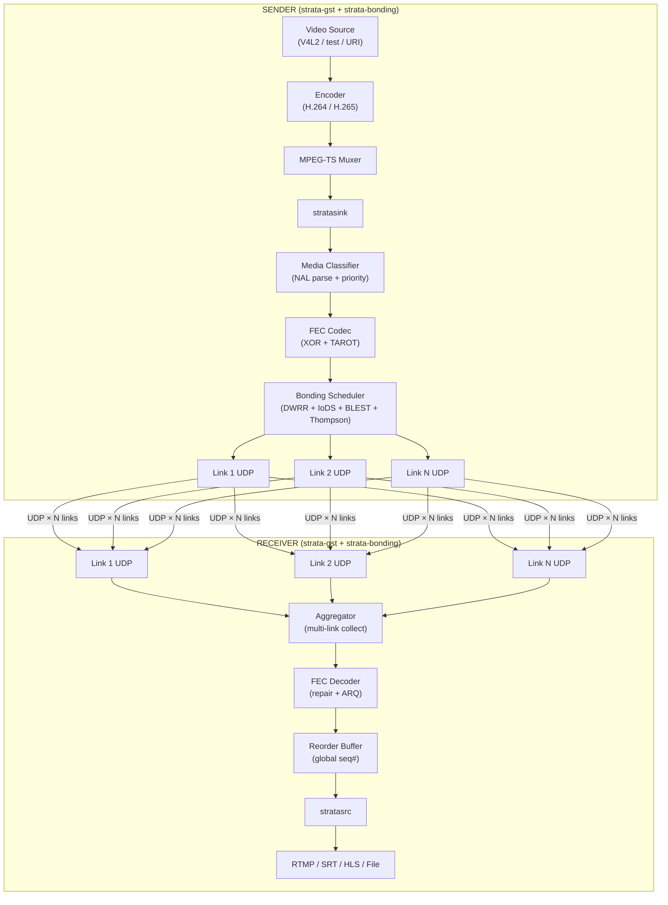
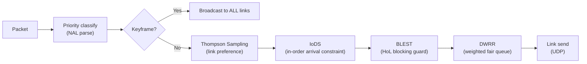
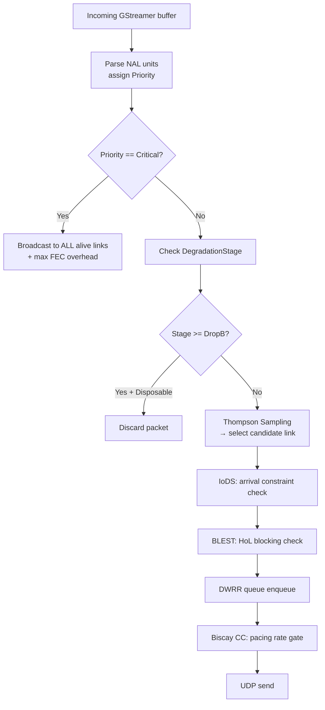
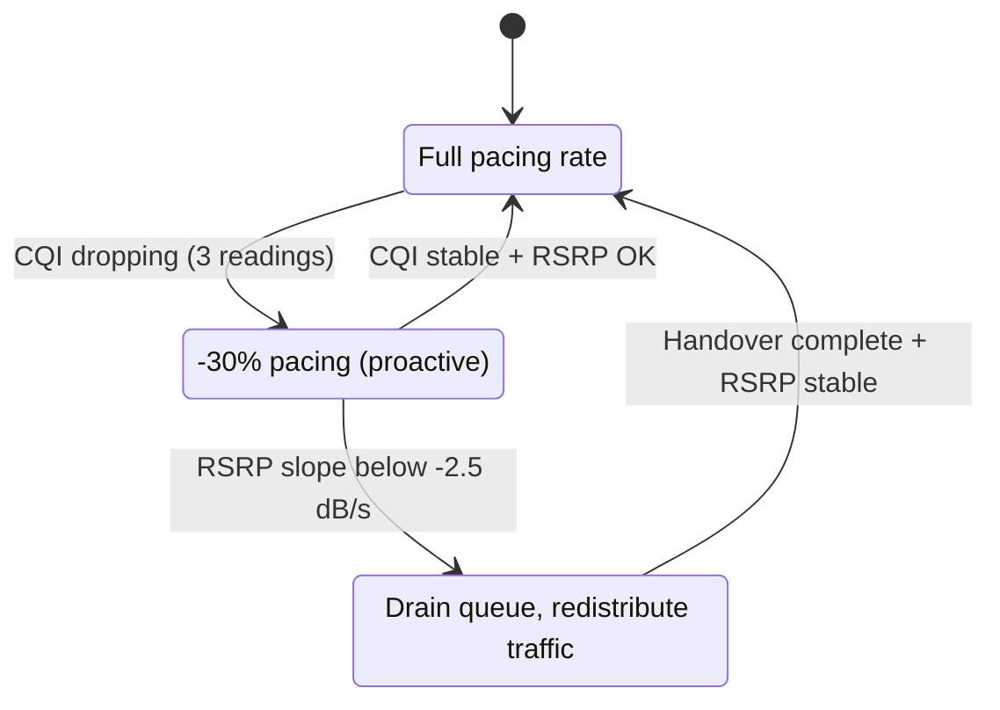
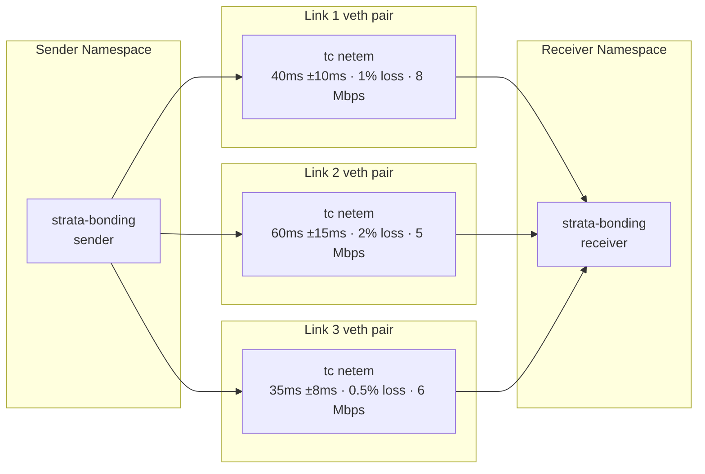

# Strata Bonded Transport System Specification

**Role:** Senior Systems Architect & Transport Engineer  
**Date:** February 2026  
**Status:** Approved for Implementation

---

## 1. System Overview

### High-Level Architecture

Strata is a userspace bonded video transport solution that aggregates bandwidth across multiple heterogeneous network interfaces (LTE, 5G, WiFi, Ethernet) into a single resilient live video stream. It uses GStreamer for the media pipeline and pure Rust for all transport, scheduling, and I/O logic.

**Core Philosophy:**
- **Custom wire protocol** — the transport layer is a purpose-built pure-Rust UDP protocol with QUIC-style sequence numbers, media-aware framing, and hybrid FEC+ARQ. No dependency on RIST, SRT, or RTP.
- **Control inversion** — `strata-transport` handles network I/O. All intelligence (retransmission, scheduling, bonding) lives in `strata-bonding`.
- **GStreamer integration** — the bonding engine sits behind two GStreamer elements (`stratasink`, `stratasrc`) and integrates naturally into any GStreamer pipeline.

### End-to-End Dataflow



**Sender path:**
1. GStreamer captures video → encodes → muxes to MPEG-TS → hands to `stratasink`
2. `strata-bonding` classifies NAL units by priority, applies FEC encoding, and schedules packets across available links
3. Each link sends via `strata-transport` over UDP
4. The modem supervisor provides RF metrics (SINR, RSRP, CQI) that feed into congestion control and scheduling

**Receiver path:**
1. `stratasrc` receives packets on all links via `strata-transport`
2. FEC decoder recovers lost packets; NACK-based ARQ handles burst losses beyond FEC capacity
3. Reorder buffer reassembles the original stream using global sequence numbers
4. Output is standard GStreamer buffers

---

## 2. Runtime Contexts

The system operates in a hybrid sync/async model.

### 1. GStreamer Context (Sync)

- **Role:** Data ingest and output.
- **Thread:** GStreamer streaming thread.
- **Constraints:** Real-time sensitive — `chain()` functions must not block indefinitely.
- **Bridge:** Bounded crossbeam channels hand data off to the bonding runtime.

### 2. Bonding Runtime (Async / io_uring)

- **Role:** Network I/O, timer management, scheduling, stats collection.
- **Thread:** Dedicated thread-per-core runtime using `monoio` (io_uring).
- **Components:**
    - `BondingRuntime` — spawns per-link tasks and routes packets through the scheduler
    - `LinkTask` — per-interface UDP I/O, Biscay CC, PING/PONG RTT probing
    - `SchedulerTask` — DWRR, IoDS, BLEST, Thompson Sampling

### 3. Control Plane Context (Async / Tokio)

- **Role:** REST API, WebSocket hubs, agent connections, database.
- **Runtime:** `tokio` (required for Axum/WebSocket ecosystem).
- **Crate:** `strata-control` — completely isolated from the hot transport path.

---

## 3. Component Breakdown

### A. `stratasink` (GStreamer Sink Element)

- **Type:** `GstBaseSink`
- **Inputs:** `video/mpegts` or any byte stream
- **Properties:**
    - `destinations` — comma-separated `host:port` pairs
    - `config` — inline TOML configuration string
    - `config-file` — path to a TOML config file
    - Per-link request pads (`link_%u`) with `uri` and `interface` properties
- **Responsibility:**
    - Initialize the bonding runtime
    - Wrap incoming GStreamer buffers and push to the bonding scheduler
    - Post `strata-stats` and `congestion-control` bus messages at regular intervals

### B. `BondingScheduler` (strata-bonding)

The intelligence layer of the sender.

- **State:**
    - `link_table` — per-link state including DWRR queue, Kalman filter, Thompson priors
    - `global_seq` — `AtomicU64` monotonic sequence number
    - `degradation_stage` — `DegradationStage` computed by `BitrateAdapter`
- **Scheduling pipeline:**



### C. `TransportLink` (strata-transport)

Per-link transport layer handling the custom wire protocol.

- **Responsibilities:**
    - Custom packet header serialization (VarInt, media flags, timestamps)
    - Biscay congestion control (BBRv3 + radio feed-forward)
    - Session management (handshake, keepalive, link join/leave)
    - ACK/NACK processing and ARQ retransmit
    - Per-link statistics export
- **API:**
    - `send_data(buf, priority)` — schedule packet with priority marker
    - `get_metrics()` → RTT, capacity, loss, phase, SINR

### D. `stratasrc` (GStreamer Push Source)

- **Type:** `GstPushSrc`
- **Properties:**
    - `links` — comma-separated bind addresses
    - `latency` — reassembly buffer latency in milliseconds
    - `config` / `config-file`
- **Responsibility:**
    - Spawns `ReceiverRuntime` (multi-link aggregator + reorder buffer)
    - Pulls ordered buffers from the output channel
    - Posts `strata-stats` bus messages for receiver telemetry

### E. `ReceiverRuntime` (strata-bonding)

Re-ordering and de-jittering of the bonded stream.

- **Data structure:** `BTreeMap<SeqNum, Packet>` keyed on global sequence number
- **Adaptive playout:**
    - Buffer depth = `p95_jitter × latency_multiplier` (default: ×4)
    - Hard ceiling enforced by `max_latency_ms`
    - Packets past the playout deadline are discarded (late-packet tracking)
- **FEC recovery:** Invokes the FEC decoder when gaps are detected in the sequence window

> **Known Limitation — NACK Suppression:** The current implementation does not
> suppress NACK (ARQ) requests for packets that have already been skipped past in
> the reassembly buffer. Retransmitted packets arriving after the playout deadline
> are correctly discarded, but the retransmission itself wastes bandwidth. This is
> tracked as a future optimization.

---

## 4. Scheduler Design

The scheduler uses **Deficit Weighted Round Robin (DWRR)** with an IoDS/BLEST dispatch pipeline and active bitrate adaptation.

### Packet Dispatch Algorithm



1. **Metric update** — driven by continuous 100ms stats callbacks from `strata-transport`, smoothed using EWMA (α ≈ 0.125) and Kalman filtering.
2. **Capacity estimation** — delivery rate from ACK feedback (bytes ACKed / ACK interval), passed through the Biscay CC `btl_bw()` windowed max-filter.
3. **DWRR** — each link has a credit bucket replenished proportionally to estimated capacity. If no link has sufficient credits, sends on the highest-credit link to avoid starvation.
4. **IoDS** — enforces monotonic arrival constraint: a packet is only assigned to a link if its predicted arrival time is ≥ the previously scheduled packet's arrival time.
5. **BLEST** — before assigning to a slow link, checks if `block_time = slow_OWD - fast_OWD > threshold` (default 50ms).

### Degradation Stages

| Stage | Action |
|---|---|
| **Normal** | All packets scheduled |
| **DropB** | Disposable (B-frame) packets silently dropped |
| **ReduceBitrate** | `BITRATE_CMD` sent to encoder via `bitrate-command` bus message |
| **KeyframeOnly** | Only Critical + Reference packets scheduled |
| **Emergency** | Only Critical (SPS/PPS/VPS) packets scheduled |

### Dynamic Link Management

Links can be added and removed at runtime without interrupting the stream:

**Link join:** Socket created → PING probes (3 successes) → Biscay slow start → quantum ramped from 0 over 500ms → `LinkJoined` event emitted

**Link leave:** Quantum set to 0 → queue drained → capacity redistributed → cleanup → `LinkLeft` event emitted

---

## 5. Custom Wire Protocol (`strata-transport`)

Strata uses a purpose-built UDP protocol replacing RIST/SRT. See the [Architecture wiki](wiki/Architecture.md) for the complete technical reference.

### Wire Format

12-byte base header with QUIC-style VarInt sequence numbers (62-bit space):

```
 0                   1                   2                   3
 0 1 2 3 4 5 6 7 8 9 0 1 2 3 4 5 6 7 8 9 0 1 2 3 4 5 6 7 8 9 0 1
+-+-+-+-+-+-+-+-+-+-+-+-+-+-+-+-+-+-+-+-+-+-+-+-+-+-+-+-+-+-+-+-+
|V=1|T| F |K|C|R|          Payload Length (16)                   |
+-+-+-+-+-+-+-+-+-+-+-+-+-+-+-+-+-+-+-+-+-+-+-+-+-+-+-+-+-+-+-+-+
|                    Sequence Number (VarInt, 1-8 bytes)         |
+-+-+-+-+-+-+-+-+-+-+-+-+-+-+-+-+-+-+-+-+-+-+-+-+-+-+-+-+-+-+-+-+
|                    Timestamp (32-bit, µs)                      |
+-+-+-+-+-+-+-+-+-+-+-+-+-+-+-+-+-+-+-+-+-+-+-+-+-+-+-+-+-+-+-+-+
```

| Field | Bits | Description |
|---|---|---|
| V | 2 | Version (1) |
| T | 1 | 0 = Data, 1 = Control |
| F | 2 | Fragment: 00=Complete, 01=Start, 10=Middle, 11=End |
| K | 1 | Keyframe flag |
| C | 1 | Codec config (SPS/PPS/VPS) |
| R | 1 | Reserved |
| Payload Length | 16 | Bytes after header |
| Sequence Number | 8-64 | QUIC VarInt (RFC 9000) — 62-bit space, no wraparound |
| Timestamp | 32 | Microsecond wall clock |

### Control Packets

| Subtype | Name | Purpose |
|---|---|---|
| 0x01 | ACK | Cumulative + selective ACK bitmap |
| 0x02 | NACK | Explicit loss report (range-based) |
| 0x03 | FEC_REPAIR | Coded repair symbol |
| 0x04 | LINK_REPORT | Per-link RTT, loss, capacity, SINR |
| 0x05 | BITRATE_CMD | Encoder adaptation command |
| 0x06 | PING/PONG | RTT measurement probe |
| 0x07 | SESSION | Handshake / teardown / link join / link leave |

### Hybrid FEC + ARQ

- **Layer 1 — Thin Continuous FEC** — systematic XOR-based coding (K source + R repair symbols). Always-on 5–10% overhead. At zero loss, receiver processes source packets directly with no decode overhead.
- **Layer 2 — NACK-Triggered Coded Repair** — receiver detects gaps, sends range-based NACK; sender responds with additional coded symbols from the same FEC generation.
- **Layer 3 — TAROT Adaptive FEC Rate** — optimizes R/K ratio every 100ms per link:

$$J = \alpha \cdot P_{loss}(r) + \beta \cdot B_{overhead}(r) + \gamma \cdot D_{decode}(r)$$

Default weights: α=5 (loss), β=2 (bandwidth), γ=3 (latency).

### Biscay Congestion Control

BBRv3 extended with cellular radio feed-forward (SINR→capacity ceiling, CQI derivative tracking, handover detection):



---

## 6. Statistics & Observability

All telemetry is exportable at three levels. See [Telemetry wiki](wiki/Telemetry.md) for full schemas.

**Per-link metrics (strata-stats bus messages + Prometheus):**

| Metric | Description |
|---|---|
| `rtt_ms` | Smoothed RTT (SRTT/RTTVAR per RFC 6298) |
| `capacity_bps` | BtlBw from Biscay delivery-rate estimation |
| `observed_bps` | Actual send rate (EWMA) |
| `loss_rate` | Packet loss rate (0.0–1.0) |
| `phase` | Link lifecycle phase (Init/Probe/Warm/Live/Degrade/Cooldown) |
| `alive` | Link up/down status |

**System-level metrics:**

| Metric | Description |
|---|---|
| `total_capacity_bps` | Sum of alive link capacities |
| `retransmissions_total` | NACK-triggered retransmissions |
| `fec_repairs_total` | FEC repair symbols sent |
| `late_packets_total` | Packets arriving after playout deadline |
| `receiver_queue_depth` | Packets in reassembly buffer |

**Export methods:**
- GStreamer bus messages (`strata-stats`, `congestion-control`, `bitrate-command`)
- Prometheus HTTP endpoint (`--metrics-port`)
- UDP JSON relay (`--stats-dest`)

---

## 7. Network Simulation & Testing

### Architecture

- **Host:** Linux kernel ≥ 5.10
- **Environment:** Dev container with `CAP_NET_ADMIN` / `CAP_NET_RAW`

### Simulation Topology

The `strata-sim` crate manages isolated Linux network namespaces with `veth` pairs and `tc netem` impairments:



### Validation Strategy

| Tier | Method | Assertions |
|---|---|---|
| **Tier 1** | Deterministic seeded-RNG simulation | Packet delivery, sequence order |
| **Tier 2** | Property-based testing (proptest) | VarInt roundtrip, FEC decode correctness, DWRR fairness |
| **Tier 3** | tc netem + Linux network namespaces | Throughput stability CV < 45%, recovery within 2 GOPs |
| **Tier 4** | cargo-fuzz on wire parser | No panic, no undefined behaviour on malformed input |

---

## 8. Explicit Non-Goals

1. **RIST/SRT integration** — Strata uses a custom pure-Rust wire protocol. No librist or libsrt dependency.
2. **Windows support** — targets Linux only. Linux network namespaces and `CAP_NET_ADMIN` are required for simulation tests.
3. **Non-MPEG-TS content** — primary target is MPEG-TS; other containers may work but are untested.
4. **AV1 hardware encode support** — AV1 NAL (OBU) parsing is not yet fully implemented. H.264 and H.265 (HEVC) are the supported codecs. AV1 is deferred until hardware encoders are available on target platforms.
5. **Encryption at the transport layer** — encryption is the responsibility of the application or an outer TLS/WireGuard layer. The transport does not implement it.
