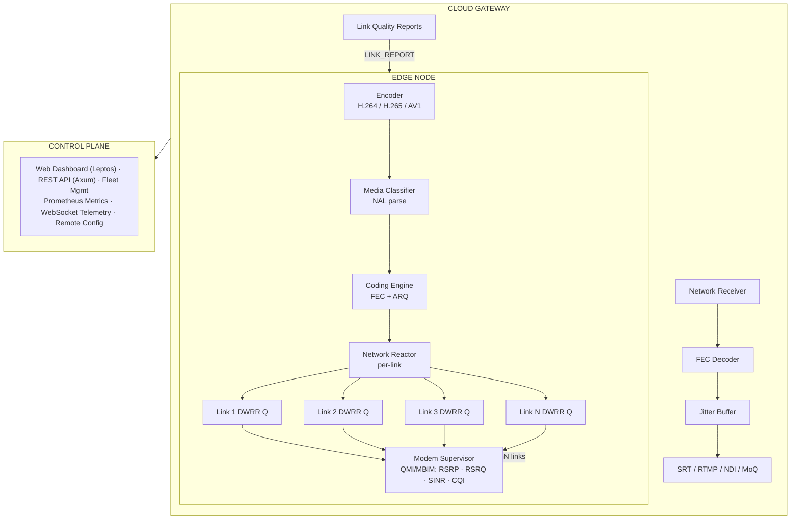
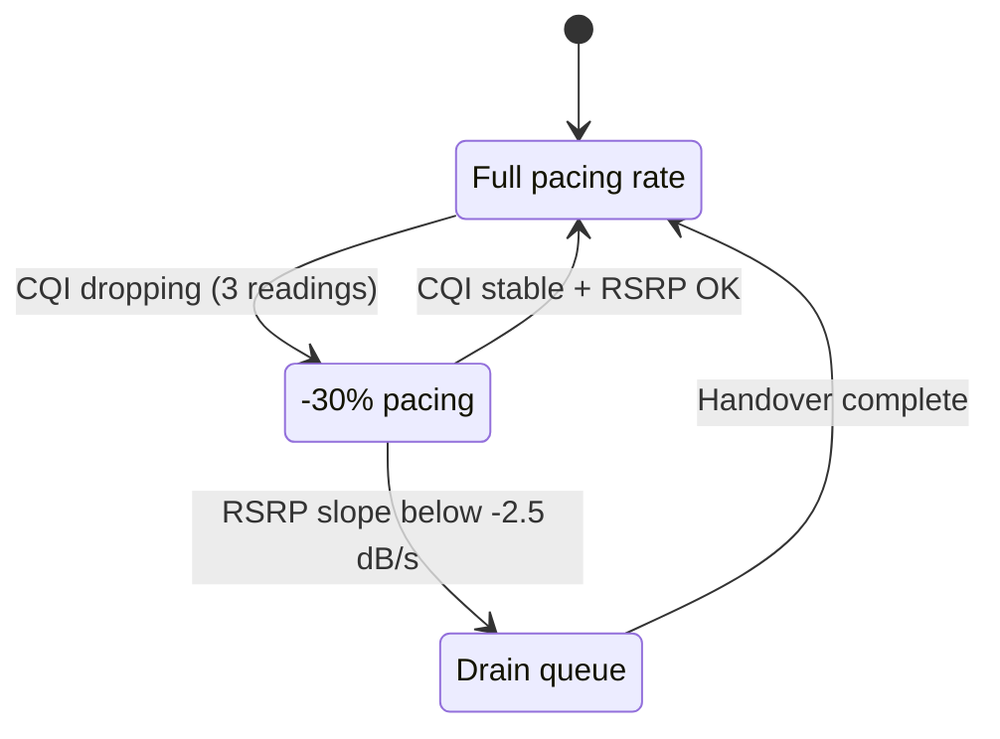
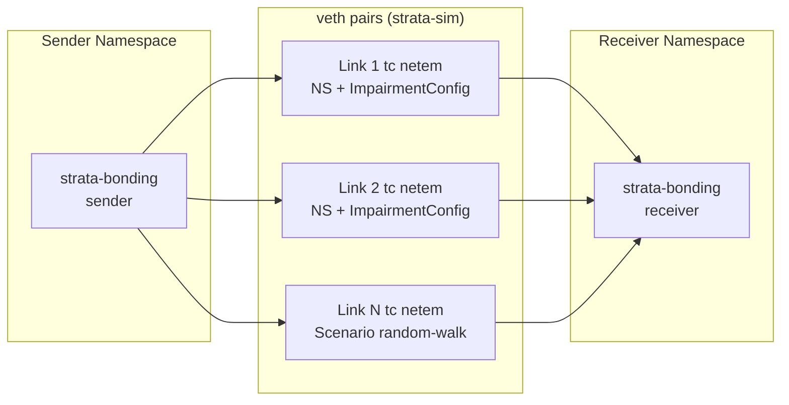
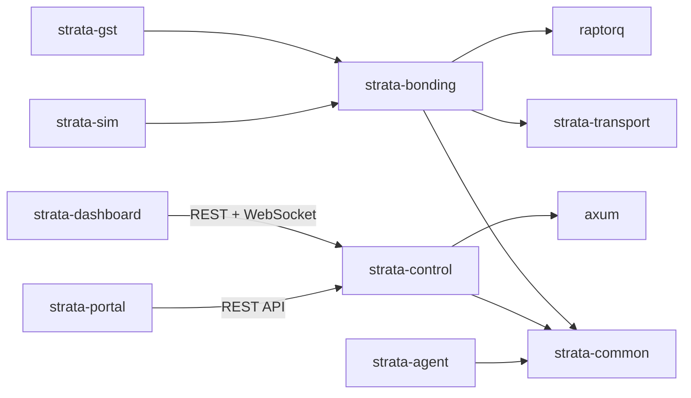

# Strata Transport — Master Plan

> A next-generation bonded cellular video transport system in Rust.
> This document synthesizes research from 7 deep-dive reports and defines the
> architecture, protocol design, implementation strategy, and phased roadmap.

---

## Table of Contents

1. [Vision & Competitive Positioning](#1-vision--competitive-positioning)
2. [Architecture Overview](#2-architecture-overview)
3. [Protocol Wire Format](#3-protocol-wire-format)
4. [Reliability: Hybrid FEC + ARQ](#4-reliability-hybrid-fec--arq)
5. [Congestion Control: Biscay](#5-congestion-control-biscay)
6. [Multi-Link Scheduling](#6-multi-link-scheduling)
7. [Modem Intelligence Layer](#7-modem-intelligence-layer)
8. [Media Awareness](#8-media-awareness)
9. [Rust Runtime & I/O Architecture](#9-rust-runtime--io-architecture)
10. [Buffer Management](#10-buffer-management)
11. [Simulation & Testing](#11-simulation--testing)
12. [Crate Structure](#12-crate-structure)
13. [Phased Roadmap](#13-phased-roadmap)

---

## 1. Vision & Competitive Positioning

### The Gap

Commercial bonded cellular systems (LiveU LRT, TVU IS+, Dejero Smart Blending)
achieve 99.999% reliability and sub-second latency by tightly coupling **physical
layer intelligence** (SINR/CQI from modems) with **transport layer scheduling**
and **application layer adaptation** (encoder bitrate control). They cost
$15,000–$25,000 per unit.

Open standards (SRT, RIST) provide solid point-to-point reliability but lack:
- True N-link bonding with per-packet scheduling
- Modem RF intelligence feed-forward
- Predictive (not reactive) congestion control
- Closed-loop encoder bitrate adaptation
- Media-aware prioritization (keyframes vs. disposable frames)

### Our Thesis

Strata bridges this gap by building a **pure Rust transport** that is:

1. **Better than RIST** — sliding-window RLNC (not block FEC), media-aware
   framing, radio-aware congestion control
2. **Open** — dual MIT/Apache-2.0, no C dependencies, no vendor lock-in
3. **Affordable** — runs on commodity ARM64 hardware (RPi5, Jetson) with
   off-the-shelf USB modems
4. **Observable** — first-class Prometheus metrics, web dashboard, fleet
   management

### Competitive Moat Summary

| Capability | LiveU | TVU | Dejero | SRT | RIST | **Strata** |
|---|---|---|---|---|---|---|
| N-link bonding | ✓ (6+) | ✓ (12) | ✓ (3-6) | Limited | Load share | **✓ (2-6)** |
| Per-packet scheduling | ✓ | ✓ | ✓ | Round-robin | — | **IoDS/BLEST** |
| RF-aware routing | ✓ | ✓ | ✓ | ✗ | ✗ | **Biscay CC** |
| Predictive handover | ✓ | ✓ | ✓ | ✗ | ✗ | **Kalman + LSTM** |
| Adaptive FEC rate | Dynamic | RaptorQ | — | ✗ | ✗ | **TAROT cost fn** |
| Sub-second latency | ~0.5s | 0.3s | 0.5s | ~0.5s | ~0.5s | **Target 0.3s** |
| Encoder feedback loop | ✓ | ✓ | ✓ | ✗ | TR-06-04 | **Built-in** |
| Open source | ✗ | ✗ | ✗ | ✓ | Spec only | **✓** |
| Price | $15K+ | $15K+ | $15K+ | Free | Free | **Free** |

---

## 2. Architecture Overview



### Actor Model

The hot path uses three actors per direction, inspired by the MoQ object model:

| Actor | Responsibility | Thread model |
|---|---|---|
| **Input Actor** | Receives media, parses NAL units, classifies priority | Pinned core |
| **Coding Actor** | Applies RLNC/RS encoding, manages FEC generations | Pinned core |
| **Network Actor** | Per-link DWRR queues, UDP I/O, congestion control | Pinned core (1 per link or shared) |

Actors communicate via lock-free SPSC ring buffers (`rtrb`), not channels.

---

## 3. Protocol Wire Format

### Design Principles

- **No RTP dependency** — custom lightweight header, not 12-byte RTP overhead
- **QUIC-style VarInt** — 62-bit sequence space (eliminates 16-bit wraparound)
- **Media-aware flags** — keyframe, config, fragment markers in the header
- **Extensible** — reserved bits for future fields

### Packet Header (12 bytes base)

```
 0                   1                   2                   3
 0 1 2 3 4 5 6 7 8 9 0 1 2 3 4 5 6 7 8 9 0 1 2 3 4 5 6 7 8 9 0 1
+-+-+-+-+-+-+-+-+-+-+-+-+-+-+-+-+-+-+-+-+-+-+-+-+-+-+-+-+-+-+-+-+
|V=1|T| F |K|C|R|          Payload Length (16)                   |
+-+-+-+-+-+-+-+-+-+-+-+-+-+-+-+-+-+-+-+-+-+-+-+-+-+-+-+-+-+-+-+-+
|                    Sequence Number (VarInt, 1-8 bytes)         |
+-+-+-+-+-+-+-+-+-+-+-+-+-+-+-+-+-+-+-+-+-+-+-+-+-+-+-+-+-+-+-+-+
|                    Timestamp (32-bit, µs)                      |
+-+-+-+-+-+-+-+-+-+-+-+-+-+-+-+-+-+-+-+-+-+-+-+-+-+-+-+-+-+-+-+-+
```

| Field | Bits | Description |
|---|---|---|
| V | 2 | Version (1) |
| T | 1 | Type: 0 = Data, 1 = Control |
| F | 2 | Fragment: 00=Complete, 01=Start, 10=Middle, 11=End |
| K | 1 | Is Keyframe |
| C | 1 | Is Codec Config (SPS/PPS/VPS) |
| R | 1 | Reserved |
| Payload Length | 16 | Payload bytes after header |
| Sequence Number | 8-64 | QUIC-style VarInt (1, 2, 4, or 8 bytes) |
| Timestamp | 32 | Microsecond wall clock (wraps every ~71 minutes) |

### Control Packets

Control packets (T=1) carry a 1-byte subtype:

| Subtype | Name | Purpose |
|---|---|---|
| 0x01 | ACK | Cumulative + selective ACK bitmap |
| 0x02 | NACK | Explicit loss report (range-based) |
| 0x03 | FEC_REPAIR | Coded repair symbol |
| 0x04 | LINK_REPORT | Per-link RTT, loss, capacity, SINR |
| 0x05 | BITRATE_CMD | Encoder adaptation command |
| 0x06 | PING/PONG | RTT measurement probe |
| 0x07 | SESSION | Handshake / teardown |

### FEC Repair Packet Extension

When T=1 and subtype=0x03, the header is followed by:

```
+-+-+-+-+-+-+-+-+-+-+-+-+-+-+-+-+-+-+-+-+-+-+-+-+-+-+-+-+-+-+-+-+
|  Generation ID (16)   |  Symbol Index (8) |  K (8)  | R (8)  |
+-+-+-+-+-+-+-+-+-+-+-+-+-+-+-+-+-+-+-+-+-+-+-+-+-+-+-+-+-+-+-+-+
```

- **Generation ID**: which FEC generation this repair belongs to
- **K**: number of source symbols in generation
- **R**: total repair symbols generated

---

## 4. Reliability: Hybrid FEC + ARQ

The key insight from research: **pure ARQ is too slow** (wastes an RTT) and
**pure FEC wastes bandwidth** on clean links. Strata uses a **hybrid** approach
with two FEC tiers operating at different layers.

### Layer 1: Sliding-Window RLNC (strata-transport)

- **Always on**: 5-10% coded redundancy, continuously streamed
- **Systematic**: source packets sent unencoded (zero latency in no-loss case),
  repair symbols generated from a sliding window
- **Sliding window**: RLNC over a sliding window of W=64 packets — no
  accumulate-and-wait like block codes. Repair symbols can reference any packet
  still in the window, giving immediate recoverability
- **GF(2^8) coding**: coefficients drawn from Galois Field(256) using a
  seeded PRNG (seed = window start sequence), enabling multi-loss recovery.
  Each repair symbol is an independent random linear combination of all
  source symbols in the window
- **Progressive decoding**: Gaussian elimination applied incrementally as
  repair symbols arrive — no need to wait for a full batch
- **Zero CPU at zero loss**: receiver processes source packets directly; only
  invokes the RLNC decoder when losses are detected

### Layer 1b: Unequal Error Protection (strata-bonding)

The bonding layer applies **differential FEC overhead** based on media priority
(see §8). This is *in addition to* the transport-level RLNC:

| Protection Level | Overhead | Use Case |
|---|---|---|
| **High** | 50% (2:1) | Critical / I-frame data |
| **Low** | 10% (10:1) | P/B-frame, droppable data |
| **None** | 0% | Raw passthrough (already protected by Layer 1) |

UEP uses RaptorQ (RFC 6330) fountain codes at the bonding layer, with a
Gilbert-Elliott channel model driving dynamic overhead adjustment.

Implementation: `strata-bonding/src/scheduler/fec.rs`

### Layer 2: NACK-Triggered Coded Repair

When the thin FEC is insufficient (burst loss exceeding the repair rate):

1. Receiver detects gap via sequence numbers
2. Sends NACK control packet (range-based, efficient for bursts)
3. Sender responds with **additional coded symbols from the same RLNC
   generation** — NOT a retransmission of the original packet
4. Any repair symbol can fill any gap — no "which exact packet was lost" problem

### Layer 3: TAROT Adaptive FEC Rate

The FEC overhead (R/K ratio) is not static. It is controlled by the **TAROT cost
function** that minimizes:

$$J = \alpha \cdot P_{loss}(r) + \beta \cdot B_{overhead}(r) + \gamma \cdot D_{decode}(r)$$

Where:
- $P_{loss}(r)$ = probability of unrecoverable loss at FEC rate $r$
- $B_{overhead}(r)$ = bandwidth consumed by FEC at rate $r$
- $D_{decode}(r)$ = decoding latency at rate $r$
- $\alpha, \beta, \gamma$ = tunable weights (latency-focused default: $\alpha=5, \beta=2, \gamma=3$)

The optimizer runs every 100ms, adjusting R per link based on observed loss rate.
This is what LiveU calls "dynamic FEC" — we make it mathematically rigorous.

### FEC Performance Budget

| Platform | RLNC GF(2^8) throughput | RaptorQ throughput | Link budget |
|---|---|---|---|
| x86 AVX2 | ~4 GB/s (SIMD XOR chains) | >10 GB/s | 400,000× headroom |
| ARM64 NEON (RPi5) | ~1.5 GB/s | ~2 GB/s | 150,000× headroom |
| ARM64 (RPi3) | ~500 MB/s | ~200 Mb/s | 50× headroom |

FEC encoding/decoding is **negligible** at 2-10 Mbps. CPU is free for scheduling.

---

## 5. Congestion Control: Biscay

Named for the Bay of Biscay (rough waters), Biscay is our radio-aware congestion
control algorithm. It extends BBRv3 with cellular modem intelligence.

### BBRv3 Base Layer

Standard BBRv3 per-link:
- Models bottleneck bandwidth (BtlBw) and minimum RTT (RTprop)
- Probes for bandwidth periodically (PROBE_BW phase)
- Fights bufferbloat by targeting BDP, not filling buffers
- Uses ECN signals when available

### Radio Feed-Forward Extension

Where Biscay diverges from pure BBRv3:

1. **SINR → Capacity Estimate**: The modem supervisor provides SINR readings
   every 100ms. A lookup table maps SINR to theoretical PHY-layer throughput
   (based on 3GPP MCS tables). This provides a **ceiling** on BtlBw that BBR
   cannot exceed, preventing it from probing into a capacity that physically
   doesn't exist.

2. **CQI Derivative Tracking**: If CQI is dropping (first derivative negative
   for 3+ consecutive readings), Biscay proactively reduces the pacing rate
   by 30% BEFORE packet loss occurs. This is the "look-ahead" that LiveU has
   and SRT/RIST lack.

3. **Handover Detection**: When RSRP slope < -2.5 dB/s AND RSRQ < -12 dB,
   Biscay enters PRE_HANDOVER state:
   - Drains the link's DWRR queue (sends remaining packets, no new enqueues)
   - Pauses BBR probing on that link
   - Redistributes traffic to other links
   - After handover completes (RSRP stabilizes), resets BBR state and re-probes

4. **Modem Buffer Management**: Like Dejero's anti-bufferbloat, Biscay monitors
   the standing queue depth in the modem. If RTT increases by > 50% from RTprop
   without a throughput increase, it infers bufferbloat and artificially reduces
   pacing to drain the modem's internal buffer.

### State Machine



---

## 6. Multi-Link Scheduling

### Scheduler: IoDS with BLEST Fallback

Based on the research (IoDS reduces jitter by 71% vs. round-robin), we adopt a
**two-tier** scheduling approach:

#### Primary: IoDS (In-order Delivery Scheduler)

IoDS enforces a **monotonic arrival constraint**: it only assigns a packet to a
link if the predicted arrival time on that link is later than or equal to the
previously scheduled packet's arrival time on any link. This prevents receiver
reordering.

```
assign(packet, links):
    for link in links sorted by predicted_arrival_time:
        arrival = now + link.srtt + link.serialization_delay(packet.size)
        if arrival >= last_scheduled_arrival:
            last_scheduled_arrival = arrival
            return link
    # Fallback: assign to fastest link (accept reordering)
    return links.min_by(srtt)
```

#### Blocking Guard: BLEST

Before IoDS assigns to a slower link, BLEST checks whether that assignment would
cause Head-of-Line blocking at the receiver:

$$\text{block\_time} = \text{slow\_link\_OWD} - \text{fast\_link\_OWD}$$

If `block_time > threshold` (e.g., 50ms), the slow link is skipped even if it
has available bandwidth. Dynamic penalty factor δ scales with recent blocking
events.

#### Per-Link Queues: DWRR

Each link has a Deficit Weighted Round Robin queue. Weights are proportional to
the link's estimated available capacity (from Biscay CC). DWRR ensures
starvation-free fair queuing with O(1) complexity.

```rust
struct DwrrQueue {
    buffer: VecDeque<PacketHandle>,
    deficit: usize,
    quantum: usize,  // proportional to link capacity
}
```

### Link Selection: Thompson Sampling

For the meta-level decision of "which link to prefer," we use Thompson Sampling
(a contextual bandit approach):

- Each link maintains a Beta(α, β) distribution modeling its "reward"
  (successful delivery within latency budget)
- On each scheduling decision, sample from each link's Beta distribution
- Choose the link with the highest sample
- Update α (success) or β (failure) after observing outcome

Thompson Sampling handles delayed feedback better than LinUCB (which assumes
instantaneous reward) and naturally explores under-sampled links.

### Kalman Filter for Link Quality

Per-link SRTT and capacity estimates are smoothed via Kalman filtering:

- **State**: `[rtt, rtt_velocity, capacity, capacity_velocity]`
- **Measurement**: raw RTT from PING/PONG, throughput from ACK feedback
- **Prediction**: extrapolate state forward for scheduling decisions
- **RSRP slope**: Kalman also tracks RSRP trend from modem supervisor

Dead Zone heuristic: If RSRP slope < -2.5 dB/s AND RSRQ < -12 dB, the link
enters PRE_HANDOVER and is deprioritized in the scheduler.

Implementation: `strata-bonding/src/scheduler/kalman.rs`

### EWMA Smoothing Filter

Fast exponentially weighted moving average for scheduler metrics (RTT jitter,
throughput samples, queue depths) that don't require Kalman's full state model.
Used as the primary smoother inside the DWRR quantum calculator and Thompson
Sampling reward signal.

Implementation: `strata-bonding/src/scheduler/ewma.rs`

### Shared Bottleneck Detection (RFC 8382)

When two cellular modems connect to the same tower, they share backhaul. Blind
independent probing on both links causes congestion on the shared segment.
Strata implements the RFC 8382 SBD algorithm:

1. **Sample**: Collect N OWD samples per link over T-second base intervals
2. **Statistics**: Compute per-link skewness, MAD-based variability,
   oscillation frequency, and packet loss
3. **Summarise**: Aggregate base-interval statistics across M intervals
4. **Threshold**: Classify each link as "bottlenecked" if metrics exceed
   configurable thresholds
5. **Group**: Cluster bottlenecked links with similar delay distributions

When links are grouped as sharing a bottleneck, the scheduler couples their
congestion responses: a rate reduction on one link prevents the other from
filling the freed capacity on the shared segment.

Implementation: `strata-bonding/src/scheduler/sbd.rs`

### Bonding Scheduler Compositor

The `BondingScheduler<L>` struct composes all scheduling primitives into a
single unified pipeline:

```
Packet → Priority classify → Keyframe broadcast?
  → Thompson Sampling (link preference)
  → IoDS (in-order arrival constraint)
  → BLEST (HoL blocking guard)
  → DWRR (weighted fair queue)
  → Link send
```

Additional features beyond the core pipeline:
- **Critical packet broadcast**: keyframes sent to ALL alive links
- **Fast-failover mode**: broadcasts all traffic when link instability detected
- **Adaptive redundancy**: duplicates important packets when spare capacity exists
- **Escalating dead-link logging**: progressively louder warnings for failing links

Implementation: `strata-bonding/src/scheduler/bonding.rs`

---

## 7. Modem Intelligence Layer

This is the **differentiator** — what separates Strata from "SRT with multiple
IPs." Commercial systems read RF metrics at the chipset level. We do the same
via standard Linux interfaces.

### Data Sources

| Metric | Source | Polling Rate | Use |
|---|---|---|---|
| RSRP | QMI/MBIM via ModemManager | 100ms | Signal strength → capacity ceiling |
| RSRQ | QMI/MBIM via ModemManager | 100ms | Signal quality → interference level |
| SINR | QMI/MBIM via ModemManager | 100ms | True capacity indicator |
| CQI | AT commands / QMI | 100ms | MCS → theoretical throughput |
| Serving cell ID | QMI | 1s | Handover detection |
| Band | QMI | On change | Band locking decisions |

### Link Health Score

Each link gets a composite score (0-100) fed to the scheduler:

$$\text{Score} = w_1 \cdot \text{norm}(\text{SINR}) + w_2 \cdot \text{norm}(\text{RSRQ}) + w_3 \cdot (1 - \text{loss\_rate}) + w_4 \cdot (1 - \text{norm}(\text{jitter}))$$

Default weights: $w_1 = 0.35, w_2 = 0.20, w_3 = 0.30, w_4 = 0.15$

### Band Management

The modem supervisor can instruct modems to lock to specific bands to maximize
diversity:
- Modem A → Band 71 (600 MHz) — coverage/penetration
- Modem B → Band 41 (2.5 GHz, n41) — capacity
- Modem C → Band 77 (3.7 GHz, n77) — 5G capacity

This prevents multiple modems from competing for the same tower sector resources.

### Link Hotplugging

USB modems can be physically plugged in or removed at runtime. Strata must
handle dynamic link membership without interrupting the stream.

#### Detection

- **udev monitor**: The modem supervisor subscribes to udev events for
  `ACTION=add` / `ACTION=remove` on `SUBSYSTEM=net` (or `SUBSYSTEM=usb`,
  `DRIVER=qmi_wwan|cdc_mbim`)
- **ModemManager signals**: D-Bus `InterfaceAdded` / `InterfaceRemoved` on
  `org.freedesktop.ModemManager1`
- **Polling fallback**: Enumerate `/sys/class/net/` every 2 seconds

#### Link Join (modem plugged in)

1. udev event fires → supervisor detects new network interface
2. Wait for IP assignment (DHCP or QMI-initiated bearer)
3. Create new DWRR queue with initial quantum = 0 (no traffic yet)
4. Send PING probes to measure initial RTT
5. After 3 successful PINGs, initialize Biscay CC state (Slow Start)
6. Begin QMI/MBIM polling for RF metrics
7. Set Thompson Sampling prior to Beta(1, 1) (uninformative — will explore)
8. Ramp quantum up from 0 to normal over 500ms (avoid burst onto untested link)
9. Emit `LinkJoined` event to telemetry

#### Link Leave (modem unplugged / total failure)

1. udev event fires OR 5 consecutive PING timeouts → declare link dead
2. Immediately set DWRR quantum = 0 (no new packets enqueued)
3. Drain remaining packets in that link's queue:
   - If < 50ms of data: let it flush
   - If > 50ms: re-enqueue packets onto other links' DWRR queues
4. Redistribute that link's capacity proportionally to remaining links
5. Reset Thompson Sampling state for the removed link
6. Emit `LinkLeft` event to telemetry
7. Cleanup: drop Biscay CC state, close socket, release slab entries

#### Session Protocol Support

The SESSION control packet (subtype 0x07) includes a `LINK_JOIN` and
`LINK_LEAVE` variant so the receiver knows about membership changes:

| Action | Sender → Receiver | Effect |
|---|---|---|
| LINK_JOIN | New link ID + capabilities | Receiver opens per-link stats tracking |
| LINK_LEAVE | Link ID + reason code | Receiver stops expecting packets from that link |

---

## 8. Media Awareness

### NAL Unit Classification

Strata parses H.264/H.265/AV1 NAL units to classify packets by priority:

| Priority | H.264 NAL Types | H.265 NAL Types | Treatment |
|---|---|---|---|
| **Critical** | SPS, PPS (7, 8) | VPS, SPS, PPS (32-34) | Send on ALL links (broadcast), max FEC |
| **Reference** | IDR (5), I-slice | IDR, CRA, BLA | Send on best 2 links, high FEC |
| **Standard** | P-slice (1) | TRAIL_R (1) | Normal scheduling |
| **Disposable** | B-slice (1 non-ref) | TRAIL_N (0) | Lowest priority, droppable under pressure |

### Graceful Degradation Under Pressure

When aggregate capacity drops below the encoder bitrate:

1. **Stage 1**: Drop disposable (B-frame) packets
2. **Stage 2**: Send BITRATE_CMD to encoder to reduce bitrate
3. **Stage 3**: Drop standard packets, protect only Critical + Reference
4. **Stage 4**: Emergency — keyframe-only mode

This staged degradation mirrors what LiveU/TVU do internally.

### AV1-SVC Future Path

When AV1-SVC encoders become common, Strata can:
- Route base layer on the most stable link with high FEC
- Route enhancement layers on opportunistic links with lower FEC
- Drop enhancement layers first during congestion

> **Status**: AV1 NAL (OBU) parsing is not yet implemented. H.264 and H.265
> are fully supported. AV1 support will be added when AV1-SVC hardware encoders
> become available on target platforms (RPi5, Jetson).

---

## 9. Rust Runtime & I/O Architecture

### Thread-per-Core Model

Research is unanimous: for sub-millisecond timing on 3-6 links, the
**thread-per-core shared-nothing** model beats tokio's work-stealing scheduler.

| Component | Runtime | Justification |
|---|---|---|
| Network I/O hot path | `monoio` (io_uring) | Zero-syscall I/O via SQPOLL, no Send/Sync bounds |
| Fallback (macOS dev) | `monoio` (epoll fallback) | Same API, cross-platform dev |
| Timer precision | `quanta` (TSC) | Nanosecond timing, bypasses VDSO |
| Control plane | `tokio` | Axum/Leptos ecosystem compatibility |

**If monoio proves too immature**, fallback plan: `tokio` with
`current_thread` runtime, pinned to cores, with `SO_BUSY_POLL` via `socket2`.

### I/O Strategy

- **UDP socket**: `quinn-udp` for GSO/GRO batching and ECN support
- **Busy polling**: `SO_BUSY_POLL` socket option (kernel polls NIC driver queue)
- **Spin loop**: `std::hint::spin_loop()` in reactor for < 1ms waits
- **Batch caution**: At 2-10 Mbps, aggressive batching is counterproductive.
  Small batch (2-4 packets) or immediate send preferred.

### OS Tuning (Production)

```bash
# Isolate cores for network threads
GRUB_CMDLINE_LINUX="isolcpus=2,3 nohz_full=2,3 rcu_nocbs=2,3"

# IRQ affinity: pin NIC IRQs to same core as network thread
echo 4 > /proc/irq/<NIC_IRQ>/smp_affinity

# Busy poll: kernel-side NIC polling
sysctl net.core.busy_poll=50
sysctl net.core.busy_read=50
```

---

## 10. Buffer Management

### Slab Allocation

Pre-allocate packet buffer pools at startup. O(1) insert/remove, no heap churn.

```rust
use slab::Slab;

struct PacketPool {
    buffers: Slab<[u8; 1500]>,    // MTU-sized buffers
    contexts: Slab<PacketContext>, // metadata (seqno, timestamps, FEC info)
}

struct PacketContext {
    sequence: u64,
    timestamp_us: u32,
    priority: Priority,
    fec_generation: u16,
    send_time: quanta::Instant,
    retry_count: u8,
}
```

### Pool Sizing

At 10 Mbps with 1500-byte packets: ~833 packets/second.
With 1-second retransmit buffer: ~1000 packet slots.
With 3-second deep buffer: ~3000 slots.
Pre-allocate 4096 slots (6 MB) — trivial memory footprint.

### Zero-Copy Pipeline

1. `quinn-udp` reads into pre-allocated `BytesMut`
2. Header parsed in-place (zero copy)
3. `Bytes` handle created pointing into the buffer (refcounted, no copy)
4. Passed through RLNC decoder (in-place XOR when possible)
5. Delivered to application via `Bytes` handle
6. Buffer returned to pool on drop

### Zero-Copy Send Abstraction

The `ZeroCopySender` trait provides a future integration point for `io_uring`
zero-copy transmit. When `io_uring` support is enabled, packet payloads skip
the kernel copy on `sendto(2)` by registering fixed buffers:

- `FallbackSender` — standard `sendto(2)` path (current default)
- Future: `IoUringSender` — `io_uring SQE` with `IORING_OP_SEND_ZC`

Implementation: `strata-bonding/src/net/zerocopy.rs`

---

## 11. Simulation & Testing

### Tier 1: Deterministic Simulation

> **Implementation note**: turmoil (tokio-only) was replaced with seeded-RNG
> deterministic simulations that run on monoio. Same guarantees — reproducible,
> single-threaded, simulating loss/burst/reordering/partitions — without the
> runtime coupling.

- Seeded RNG for reproducible failures
- Simulate: packet loss, reordering, latency spikes, partitions
- Run entire multi-host protocol in a single thread
- **Every protocol change must pass deterministic simulation tests**

### Tier 2: Property-Based Testing (proptest)

- Sequence number wraparound (VarInt boundary values)
- RLNC decode correctness for all loss patterns up to K losses
- DWRR fairness invariants (bandwidth proportional to weight ± ε)
- State machine invariants (ACKed bytes never decrease)
- Congestion window monotonicity during steady state

### Tier 3: Network Namespace Simulation

Replace ns-3 (too CPU-heavy) with **tc netem + Linux network namespaces**:

> **Implementation note**: The original plan specified Docker bridge networks.
> In practice, Linux network namespaces with veth pairs proved lighter,
> faster to set up/tear down, and more controllable for CI. The `strata-sim`
> crate wraps the `ip netns` / `tc netem` APIs directly.



Test scenarios (in `strata-sim/tests/tier3_netem.rs`):

| Test | What it validates |
|---|---|
| `capacity_step_change` | Throughput recovers after mid-stream bandwidth drop |
| `link_failure_recovery` | Survives link down/up cycle without crash |
| `chaos_scenario` | 25s of evolving impairment via `Scenario` random-walk |
| `throughput_stability` | CV < 30% over 20s proves no oscillation/drift |
| `asymmetric_rtt_bonding` | Both links carry traffic with 20ms vs 150ms RTT |

#### Impairment Model

- **Loss**: Gilbert-Elliott (bursty) — `tc netem loss gemodel p q 1-r 1-k`
- **Jitter**: Pareto distribution — `tc netem delay 50ms 20ms distribution pareto`
- **Bandwidth**: Token bucket filter — `tc qdisc add dev eth0 root tbf rate 5mbit`
- **Mahimahi traces**: Replay real cellular bandwidth traces via dynamic tc updates

#### Controller

Python sidecar using `pyroute2` (direct Netlink, no shell forks):

```python
from pyroute2 import IPRoute, NetNS
ipr = IPRoute()
# Set impairment on veth to sender
ipr.tc("replace", "netem", link_index, delay=50000, jitter=20000,
       loss_model="gemodel", p=5, r=95, h=0.1, k=99.9)
```

#### Path Isolation: Policy-Based Routing (PBR)

Without PBR, the Linux kernel may short-circuit the simulation by routing
packets via the default gateway instead of through the impaired bridge. Each
container must enforce per-link routing:

```bash
# setup_routing.sh — run inside sender container
# Link 1: force traffic bound for receiver via bridge_1
ip route add 172.20.0.0/24 dev eth1 table 100
ip rule add from 172.20.0.2/32 lookup 100

# Link 2: force via bridge_2
ip route add 172.21.0.0/24 dev eth2 table 101
ip rule add from 172.21.0.2/32 lookup 101

# Link 3: force via bridge_3
ip route add 172.22.0.0/24 dev eth3 table 102
ip rule add from 172.22.0.2/32 lookup 102
```

#### eBPF TC Hooks (Advanced)

For sub-millisecond impairment granularity beyond what `tc netem` provides
(~1ms resolution), attach eBPF programs to the TC egress hook:

- eBPF map populated with trace profile (timestamp → action)
- Kernel-resident program checks current time against map
- Decides drop/delay/pass with nanosecond precision, zero user-space overhead
- Maps updated atomically from user space without reloading the qdisc

Use case: simulating mmWave blockage with sub-ms transitions.

#### Clock Sync & One-Way Delay Measurement

Accurate OWD measurement requires tight clock synchronization between containers:

- **Chrony container**: Local Stratum 1 NTP server in a dedicated container.
  All test containers sync solely to this reference. Provides sub-ms accuracy,
  sufficient for characterizing cellular jitter (typically 10-100ms)
- **PTP**: Optionally run `ptp4l` on the host and map `/dev/ptp0` into
  containers for microsecond-level sync
- **OWAMP**: Run `perfsonar/owamp` container for background one-way delay
  measurements parallel to the media stream — "ground truth" baseline

#### Correlated Failures & Background Traffic

Real cellular networks exhibit correlated failures and contention:

- **Shared backhaul**: Two modems on the same tower share backhaul. Simulate
  by applying identical impairment to bridge_1 and bridge_2 simultaneously
  (coordinated via net_controller)
- **Background TCP flows**: Inject `iperf3` TCP streams into the same bridges
  to create realistic bufferbloat pressure. Forces the bonding protocol to
  contend for queue space — tests AQM sensitivity
- **Correlated loss bursts**: When one link enters deep fade, adjacent bands
  on the same tower often degrade too. Model with synchronized Gilbert-Elliott
  state transitions across bridges

#### Scenarios from Real-World Data

| Scenario | Source | Parameters |
|---|---|---|
| Urban drive | MONROE dataset | Variable bandwidth, periodic handovers |
| Stadium (dense) | NYU Wireless | High loss bursts, shared backhaul |
| Rural coverage | Pantheon traces | Low bandwidth, stable but slow |
| mmWave blockage | NYU 5G | Sudden 100% loss for 200-800ms |
| Highway handover | CellReplay | RSRP ramp-down/up pattern |
| Shared backhaul | Synthetic | Correlated degradation on 2 links |
| Bufferbloat | iperf3 + netem | TCP cross-traffic on all bridges |

### Tier 4: Fuzz Testing

- `cargo-fuzz` (libFuzzer) on packet parser
- Feed random bytes into header/control packet deserializer
- AFL on protocol state machine (random packet sequences)

---

## 12. Crate Structure

```
crates/
├── strata-transport/      # Core transport protocol
│   ├── src/
│   │   ├── lib.rs         # Public API
│   │   ├── wire.rs        # Packet header serialization, VarInt
│   │   ├── codec.rs       # Sliding-window RLNC FEC engine
│   │   ├── arq.rs         # NACK tracking, repair dispatch
│   │   ├── sender.rs      # Sender state machine
│   │   ├── receiver.rs    # Receiver state machine
│   │   ├── congestion.rs  # Biscay congestion control
│   │   ├── pool.rs        # Slab packet buffer pool
│   │   ├── session.rs     # Handshake, teardown, keepalive
│   │   └── stats.rs       # Per-link statistics
│   ├── tests/             # Deterministic simulation tests
│   ├── fuzz/              # Tier 4: cargo-fuzz targets
│   ├── benches/           # Criterion benchmarks
│   └── Cargo.toml
│
├── strata-bonding/        # Multi-link scheduler & orchestrator
│   ├── src/
│   │   ├── lib.rs
│   │   ├── config.rs      # TOML configuration system
│   │   ├── metrics.rs     # Prometheus text exposition
│   │   ├── runtime.rs     # monoio/io_uring runtime builder
│   │   ├── adaptation.rs  # Encoder bitrate feedback loop
│   │   ├── scheduler/
│   │   │   ├── mod.rs
│   │   │   ├── bonding.rs # BondingScheduler compositor
│   │   │   ├── iods.rs    # In-order Delivery Scheduler
│   │   │   ├── blest.rs   # Blocking estimation guard
│   │   │   ├── dwrr.rs    # Deficit Weighted Round Robin
│   │   │   ├── thompson.rs # Thompson Sampling link selector
│   │   │   ├── kalman.rs  # Kalman filter (RTT, capacity, signal)
│   │   │   ├── ewma.rs    # EWMA smoothing filter
│   │   │   ├── sbd.rs     # Shared Bottleneck Detection (RFC 8382)
│   │   │   └── fec.rs     # UEP FEC (RaptorQ + Gilbert-Elliott)
│   │   ├── modem/
│   │   │   ├── mod.rs
│   │   │   ├── supervisor.rs  # QMI/MBIM polling daemon
│   │   │   ├── health.rs      # Link health scoring
│   │   │   └── band.rs        # Band catalog & diversity assignment
│   │   ├── media/
│   │   │   ├── mod.rs
│   │   │   ├── nal.rs     # H.264/H.265 NAL parser
│   │   │   └── priority.rs # Packet priority classification
│   │   ├── net/
│   │   │   ├── mod.rs
│   │   │   ├── interface.rs  # Link abstraction (LinkSender trait)
│   │   │   ├── signal.rs     # Wireless signal watermark
│   │   │   ├── state.rs      # Link state machine (probation/alive/dead)
│   │   │   ├── transport.rs  # UDP transport layer
│   │   │   └── zerocopy.rs   # ZeroCopySender trait (io_uring future)
│   │   ├── receiver/
│   │   │   ├── mod.rs
│   │   │   ├── aggregator.rs # Adaptive jitter buffer
│   │   │   └── transport.rs  # Multi-link receiver
│   │   └── protocol/
│   │       └── header.rs     # Bonding-layer protocol header
│   ├── tests/             # Phase 3-4 integration tests
│   └── Cargo.toml
│
├── strata-sim/            # Network simulation framework
│   ├── src/
│   │   ├── lib.rs
│   │   ├── impairment.rs  # tc netem management (delay, loss, rate)
│   │   ├── topology.rs    # Linux namespace management
│   │   ├── scenario.rs    # Deterministic random-walk impairment
│   │   ├── bonding_scenarios.rs # Pre-built LinkFailure/Handover/CorrelatedFading
│   │   └── test_util.rs   # Privilege checks, test harness helpers
│   ├── tests/             # Tier 3: tc netem integration tests
│   └── Cargo.toml
│
├── strata-gst/            # GStreamer plugin
│   ├── src/
│   │   ├── lib.rs         # Plugin registration + unit tests
│   │   ├── sink.rs        # stratasink GStreamer element
│   │   ├── src.rs         # stratasrc GStreamer element
│   │   └── bin/strata_node.rs # CLI binary (sender/receiver/loopback)
│   └── Cargo.toml
│
├── strata-common/         # Shared types, auth, IDs
│   └── src/
│       ├── lib.rs
│       ├── auth.rs        # JWT token generation/validation
│       └── ids.rs         # Type-safe ID generation
│
├── strata-control/        # Axum REST API + WebSocket hub
│   ├── src/
│   │   ├── main.rs
│   │   ├── state.rs       # AppState (DB pool, JWT secret)
│   │   ├── db.rs          # SQLite connection pool
│   │   ├── ws_agent.rs    # WebSocket: agent → control plane
│   │   ├── ws_dashboard.rs # WebSocket: dashboard → live updates
│   │   └── api/
│   │       ├── mod.rs
│   │       ├── auth.rs        # POST /register, /login (JWT)
│   │       ├── senders.rs     # Sender CRUD endpoints
│   │       ├── streams.rs     # Stream start/stop/status
│   │       └── destinations.rs # RTMP destination management
│   ├── migrations/        # SQLite schema migrations
│   ├── tests/             # API integration tests
│   └── Cargo.toml
│
├── strata-agent/          # Edge node agent
│   └── src/
│       ├── main.rs
│       ├── control.rs     # WebSocket session to control plane
│       └── telemetry.rs   # Metrics collection & relay loop
│
├── strata-dashboard/      # Leptos WASM web UI (cloud-side)
│   ├── src/
│   ├── style/
│   ├── index.html
│   └── Trunk.toml
│
├── strata-portal/         # Cloud portal (public-facing UI)
│   ├── src/
│   ├── style/
│   ├── index.html
│   └── Trunk.toml
│
└── dev/                   # Development environment
    ├── docker-compose.yml # Full-stack local environment
    ├── Dockerfile.agent   # Edge agent container
    ├── Dockerfile.control # Control plane container
    ├── Makefile           # Development shortcuts
    └── fast-reload.sh     # Hot-reload helper
```

### Dependency Graph



### Key Dependencies

| Crate | Version | Purpose | Hot path? |
|---|---|---|---|
| `monoio` | latest | io_uring async runtime | YES |
| `quinn-udp` | latest | GSO/GRO/ECN UDP abstraction | YES |
| `bytes` | 1.x | Zero-copy buffer management | YES |
| `slab` | 0.4 | Pre-allocated packet pool | YES |
| `rtrb` | 0.3 | Lock-free SPSC ring buffer | YES |
| `quanta` | 0.12 | TSC-based nanosecond timing | YES |
| `raptorq` | latest | RaptorQ fountain codes (UEP FEC) | YES |
| `crossbeam-channel` | 0.5 | Inter-thread messaging | No (control) |
| `tracing` | 0.1 | Structured logging | No (debug) |
| `proptest` | 1.x | Property-based testing | Test only |
| `tokio` | 1.x | Control plane runtime | No (control) |
| `axum` | 0.8 | REST API server | No (control) |
| `leptos` | latest | Leptos WASM dashboard | No (UI) |
| `rusqlite` | latest | SQLite persistence | No (control) |
| `jsonwebtoken` | latest | JWT auth tokens | No (control) |

---

## 13. Phased Roadmap

### Phase 0: Foundation (2-3 weeks)

**Goal**: Core UDP event loop — send and receive packets with the custom header.

- [x] Define `wire.rs`: header serialization/deserialization with VarInt seqnos
- [x] Implement packet pool (`slab` + `bytes`)
- [x] Build single-link sender: enqueue packets → serialize → UDP send
- [x] Build single-link receiver: UDP recv → deserialize → deliver
- [x] PING/PONG RTT measurement
- [x] Session handshake (SESSION control packet)
- [x] Basic stats: packets sent/received/lost, RTT
- [x] Deterministic simulation: send 10,000 packets, verify delivery
- [x] proptest: VarInt encode/decode roundtrip for all boundary values

**Crate**: `strata-transport` only
**Runtime**: Start with `tokio` current_thread (switch to monoio in Phase 2)

### Phase 1: Reliability (2-3 weeks)

**Goal**: Survive 10% random loss with zero application-visible loss.

- [x] NACK tracking: receiver detects gaps, sends NACK control packets
- [x] NACK processing: sender retransmits on NACK (plain ARQ first)
- [x] Reed-Solomon FEC: systematic encoding (K source + R repair)
- [x] FEC decode: receiver reconstructs from any K-of-N received
- [x] TAROT cost function: adaptive FEC rate per link
- [x] Deterministic simulation: 5%, 10%, 20% random loss — zero application loss
- [x] Deterministic simulation: burst loss (Gilbert-Elliott model) recovery
- [x] proptest: FEC decode correctness for all combinations of K losses

**Milestone**: Single-link reliable transport, 0% application loss at 10% network
loss, < 50ms added latency.

### Phase 2: Performance (2 weeks)

**Goal**: Sub-millisecond processing latency, production I/O.

w- [x] Migrate to monoio (or tokio current_thread + SO_BUSY_POLL)
- [x] Integrate quinn-udp for GSO/GRO
- [x] Replace channels with rtrb SPSC ring buffers
- [x] quanta for all timing (replace std::time::Instant)
- [x] Benchmark: measure P50/P99 processing latency (Criterion)
- [x] Verify < 100µs processing latency per packet

### Phase 3: Bonding (3-4 weeks)

**Goal**: 3-link bonding that outperforms SRT balancing mode.

- [x] DWRR per-link queues with configurable weights
- [x] IoDS scheduling: monotonic arrival constraint
- [x] BLEST blocking guard
- [x] Thompson Sampling link selector
- [x] Multi-link session management (one session, N links)
- [x] Per-link Biscay congestion control (BBRv3 base)
- [x] Kalman filter for RTT/capacity smoothing
- [x] EWMA smoothing filter for scheduler metrics
- [x] `BondingScheduler` compositor (IoDS + BLEST + Thompson + DWRR + Kalman)
- [x] Shared Bottleneck Detection (RFC 8382) — link grouping via OWD analysis
- [x] Network abstraction layer (`net/interface.rs`, `signal.rs`, `state.rs`, `transport.rs`)
- [x] Signal watermark (`/proc/net/wireless` and sysfs polling)
- [x] Link state machine (probation → alive → dead, with escalating logging)
- [x] ZeroCopySender trait + FallbackSender (future io_uring integration point)
- [x] Deterministic simulation: 3 links, heterogeneous RTTs, all delivered
- [x] Deterministic simulation: link failure mid-stream — seamless failover
- [x] Docker simulation: 3 bridge networks, tc netem impairment

**Milestone**: 3-link bonding, bandwidth aggregation, < 500ms glass-to-glass,
seamless link failover.

### Phase 4: Intelligence (3-4 weeks)

**Goal**: Radio-aware scheduling and media-aware prioritization.

- [x] Modem supervisor daemon (QMI/MBIM polling via ModemManager)
- [x] SINR → capacity ceiling feed-forward to Biscay
- [x] CQI derivative tracking → CAUTIOUS state
- [x] Handover detection (RSRP slope) → PRE_HANDOVER state
- [x] Link health score computation and export
- [x] NAL unit parser (H.264, H.265)
- [x] Priority classification → scheduler weight adjustment
- [x] Encoder bitrate feedback loop (BITRATE_CMD)
- [x] UEP FEC at bonding layer (RaptorQ + Gilbert-Elliott channel model)
- [x] Band catalog with tier system and diversity assignment algorithm
- [x] TOML configuration system (`BondingConfigInput` → `SchedulerConfig`)
- [ ] Docker simulation with Mahimahi cellular traces

**Milestone**: Radio-aware routing, predictive handover, media-prioritized
scheduling.

### Phase 5: Integration (2-3 weeks)

**Goal**: GStreamer plugin and full system integration.

- [x] Wire strata-bonding into strata-gst (replace librist-sys dependency)
- [x] Integration test: GStreamer → Strata → receiver → GStreamer
- [x] Remove librist-sys from active builds
- [x] End-to-end YouTube RTMP test via GStreamer
- [x] Prometheus metrics endpoint for all stats
- [x] WebSocket telemetry (strata-agent)

### Phase 6: Cloud Gateway (2-3 weeks)

**Goal**: Cloud-side receiver with fan-out and orchestration.

- [x] Cloud receiver binary (standalone, not GStreamer)
- [x] Dynamic jitter buffer (adaptive sizing based on network conditions)
- ~~SRT/RTMP/NDI output bridges~~ *(GStreamer handles output conversion)*
- [x] Control plane REST API (strata-control)
- [x] JWT authentication (register / login)
- [x] RTMP destination management (YouTube, custom RTMP endpoints)
- [x] Dual WebSocket hub (agent ↔ control ↔ dashboard)
- [x] SQLite persistence with schema migrations
- [x] Web dashboard (strata-dashboard, Leptos CSR WASM)
- [x] Cloud portal (strata-portal, Leptos CSR WASM)
- [ ] Fleet management basics (multi-unit telemetry, web UI)

### Phase 7: Hardening (Ongoing)

- [x] Fuzz testing (cargo-fuzz on wire parser + receiver state machine)
- [x] Sliding-window RLNC (replace block RS in strata-transport)
- [x] Upgrade to monoio with io_uring SQPOLL
- [x] Band locking automation
- [x] Development environment (Docker Compose, Dockerfiles, fast-reload)
- [ ] Mahimahi network simulation traces (Docker-based)
- [ ] AV1 OBU parser (when AV1-SVC hardware encoders become available)

---

## Appendix A: Research Sources

This plan synthesizes findings from 7 research documents:

1. **gemini1.md** — Beyond-RIST transport protocol design (NG-RMTP): RLNC,
   TAROT, Biscay CC, BLEST, MoQ framing, monoio/io_uring, actor model
2. **gemini2.md** — Multi-link bonding & scheduling: IoDS, ALCS, BLEST, ECF,
   DEMS, Thompson Sampling, Kalman filtering, RLNC, AV1-SVC
3. **gemini3.md** — Docker network simulation: tc netem, Gilbert-Elliott,
   pyroute2, eBPF, Mahimahi, MONROE/NYU/Pantheon datasets
4. **gemini4.md** — Rust high-performance networking: monoio vs glommio vs
   tokio, slab allocation, DWRR, Reed-Solomon, quanta, turmoil DST
5. **gemini5.md** — Competitive analysis: LiveU LRT (dynamic FEC, FPGA reorder),
   TVU IS+ (RaptorQ, 0.3s latency), Dejero Smart Blending (per-packet routing),
   Zixi (DNA alignment failover, dynamic latency), SRT bonding modes, RIST
   source adaptation, MP-QUIC schedulers, BBRv3, modem management gap
6. **chatgpt2.md** — SRT/RIST/Zixi/LiveU/TVU/Dejero protocol analysis, QUIC/
   MoQ/RoQ, open-source gap analysis
7. **chatgpt5.md** — Rust implementation specifics: async runtime benchmarks,
   bytes/slab buffer management, SPSC queues, DashMap, quanta TSC, RaptorQ ARM
   benchmarks, proptest/turmoil/cargo-fuzz testing strategies

## Appendix B: Glossary

| Term | Definition |
|---|---|
| RLNC | Random Linear Network Coding — sliding-window erasure code over GF(2^8) |
| UEP | Unequal Error Protection — differential FEC overhead by media priority |
| TAROT | Adaptive FEC rate optimization cost function |
| Biscay | Radio-aware congestion control (BBRv3 + SINR/CQI) |
| IoDS | In-order Delivery Scheduler |
| BLEST | BLocking ESTimation scheduler |
| DWRR | Deficit Weighted Round Robin |
| SBD | Shared Bottleneck Detection (RFC 8382) |
| SINR | Signal-to-Interference-plus-Noise Ratio |
| CQI | Channel Quality Indicator |
| RSRP | Reference Signal Received Power |
| RSRQ | Reference Signal Received Quality |
| NAL | Network Abstraction Layer (H.264/H.265 framing unit) |
| GSO/GRO | Generic Segmentation/Receive Offload |
| BDP | Bandwidth-Delay Product |
| MCS | Modulation and Coding Scheme |
| OWD | One-Way Delay |
| DST | Deterministic Simulation Testing |
| GF(2^8) | Galois Field with 256 elements — arithmetic field for RLNC coding |
