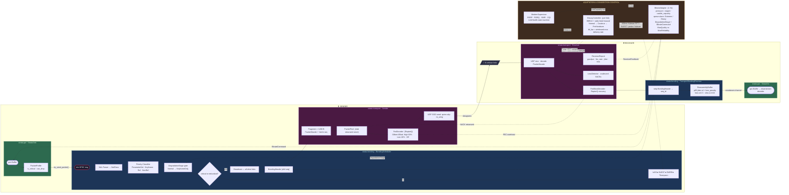

# Packet Flow — Strata Transport & GStreamer

End-to-end path of a media packet through the full sender–receiver pipeline.

```mermaid
flowchart LR

%% ═══════════════════ SENDER ═══════════════════
subgraph SND["⬇  SENDER"]
  direction TB

  subgraph GST_SND["strata-gst · StrataSink"]
    GBuf(["gst::Buffer"])
    GProf["PacketProfile\nis_critical · can_drop"]
    GBuf --> GProf
  end

  Ring(["rtrb SPSC ring"])
  GProf -->|"try_send_packet()"| Ring

  subgraph BOND_SND["strata-bonding · BondingScheduler"]
    direction TB
    Nal["NAL Parser → NalClass"]
    Pri["Priority Classifier\nParameterSet · Keyframe · Ref · NonRef"]
    Deg["DegradationStage gate\nNormal → KeyframeOnly"]
    Sel{"critical or redundant?"}
    Bcast["Broadcast — all alive links"]
    Pick["IoDS ▸ BLEST ▸ DWRR ▸ Thompson"]
    Hdr["BondingHeader  [u64 seq]"]

    Ring --> Nal --> Pri --> Deg --> Sel
    Sel -->|"yes"| Bcast --> Hdr
    Sel -->|"no"| Pick --> Hdr
  end

  subgraph T_SND["strata-transport · Sender"]
    direction TB
    Frag["Fragment > 1200 B\nPacketHeader + VarInt seq"]
    Pool["PacketPool  (slab retransmit store)"]
    FecE["FecEncoder  (RaptorQ)\nGilbert-Elliott  High 50% · Low 10% · Off"]
    Udp["UDP GSO send  quinn-udp · io_uring"]

    Frag --> Pool --> FecE --> Udp
  end

  Hdr --> Frag
end

NET[/"📡  N cellular links"/]
Udp -->|"datagrams"| NET

%% ═══════════════════ RECEIVER ═══════════════════
subgraph RCV["⬆  RECEIVER"]
  direction TB

  subgraph T_RCV["strata-transport · Receiver"]
    direction TB
    URx["UDP recv · decode PacketHeader"]
    FecD["FecBlockDecoder  RaptorQ recovery"]
    Arq["LossDetector · coalesced NACKs"]
    Rrp["ReceiverReport\ngoodput · fec_rate · jitter · loss"]

    URx --> FecD
    URx --> Arq
    URx --> Rrp
  end

  subgraph BOND_RCV["strata-bonding · TransportBondingReceiver"]
    direction TB
    Strip["strip BondingHeader → seq_id"]
    JBuf["ReassemblyBuffer\np95 jitter x4 + loss_penalty\nfast a=0.3 · slow a=0.02"]
    Strip --> JBuf
  end

  subgraph GST_RCV["strata-gst · StrataSrc"]
    GOut(["gst::Buffer → downstream decoder"])
  end

  NET --> URx
  FecD --> Strip
  JBuf -->|"crossbeam channel"| GOut
end

%% ═══════════════════ CONTROL PLANE ═══════════════════
subgraph CTRL["ADAPTATION & CONGESTION CONTROL"]
  direction LR

  Modem["ModemSupervisor\nRSRP · RSRQ · SINR · CQI\nLinkHealth state machine"]

  Bisc["BiscayController  (per link)\nBBRv3 + radio feed-forward\nNormal → Cautious → PreHandover\nbtl_bw = windowed-max delivery rate"]

  Adapt["BitrateAdapter  (1 Hz)\npressure = target / usable_capacity\nqueue alarm  Extreme / Heavy\nDegradationStage + BitrateCommand\nMaxQuality vs MaxReliability"]

  Modem -->|"RfMetrics"| Bisc
  Modem -->|"LinkCapacity vec"| Adapt
  Bisc  -->|"btl_bw"| Adapt
end

%% ─── Feedback (dashed) ───────────────────────────────
URx  -.->|"ACK + BBR delivery sample"| Bisc
URx  -.->|"Pong / RTT sample"| Bisc
Arq  -.->|"NACK retransmit"| Pool
Rrp  -.->|"ReceiverFeedback"| Adapt

Adapt -.->|"BitrateCommand"| GBuf
Adapt -.->|"FEC overhead"| FecE
Adapt -.->|"DegradationStage"| Deg
Bisc  -.->|"100ms: Kalman RTT / BLEST / probe / failover"| Pick

%% ─── Styles ──────────────────────────────────────────
classDef gst     fill:#2d6a4f,stroke:#40916c,color:#d8f3dc
classDef bonding fill:#1d3557,stroke:#457b9d,color:#a8dadc
classDef trans   fill:#4a1942,stroke:#9d4edd,color:#e0aaff
classDef net     fill:#2b2d42,stroke:#8d99ae,color:#edf2f4
classDef ctrl    fill:#3d2b1f,stroke:#c9a227,color:#ffeaa7
classDef ring    fill:#1a1a2e,stroke:#e94560,color:#fff

class GST_SND,GST_RCV gst
class BOND_SND,BOND_RCV bonding
class T_SND,T_RCV trans
class NET net
class CTRL ctrl
class Ring ring
```
